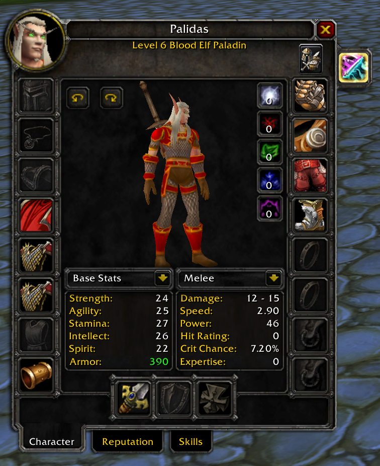

# AzerothCore Transmog System (3.3.5a)

**A Transmogrification system built with AIO and Eluna for AzerothCore.**

## 🎯 About

This project brings a fully functional Transmog system to AzerothCore servers, combining the power of [AIO](https://github.com/Rochet2/AIO) and [Eluna](https://github.com/azerothcore/mod-eluna).

Want to support the development of this and other projects?  
👉 Visit my [Patreon page](https://patreon.com/danielthedeveloper) — every bit helps!

## 📤 Installation (Server)

1. Ensure you have both [AIO](https://github.com/Rochet2/AIO) and [mod-eluna](https://github.com/azerothcore/mod-eluna) installed on your AzerothCore server.
2. Copy the contents of the `lua_scripts` folder into your Eluna/AIO Lua scripts directory.
3. Import all `.sql` files located in the `sql` folder into your server database.
4. Move the patch files into an `.mpq` archive of your choice (you can use [MPQEditor](https://www.zezula.net/en/mpq/download.html)).
5. Start your server — and enjoy your new Transmog system!

📚 For more help, check out the [mod-eluna documentation](https://github.com/azerothcore/mod-eluna).

## 📥 Installation (Client)

1. Ensure you have both the [AIO](https://github.com/Rochet2/AIO) and [Transmogrify](https://github.com/DanieltheDeveloper/azerothcore-transmog-3.3.5a/tree/master/patches/lose%20files/Interface/addons) client-side AddOns installed to the AddOns folder of your World of Warcraft installation.

## 🚧 Work in Progress (WIP)

- Preventing event spam (click handling)
- Search by display ID
- Weapon aura support
- Spells and character visual effects

## 🖼️ Screenshots

  

## ⚖️ Legal Notice

- *World of Warcraft*, *Battle.net*, *Blizzard Entertainment*, and all related trademarks and logos are property of Blizzard Entertainment.
- This project is not affiliated with Blizzard Entertainment or any of their partners.
- All other trademarks and copyrights are property of their respective owners.
